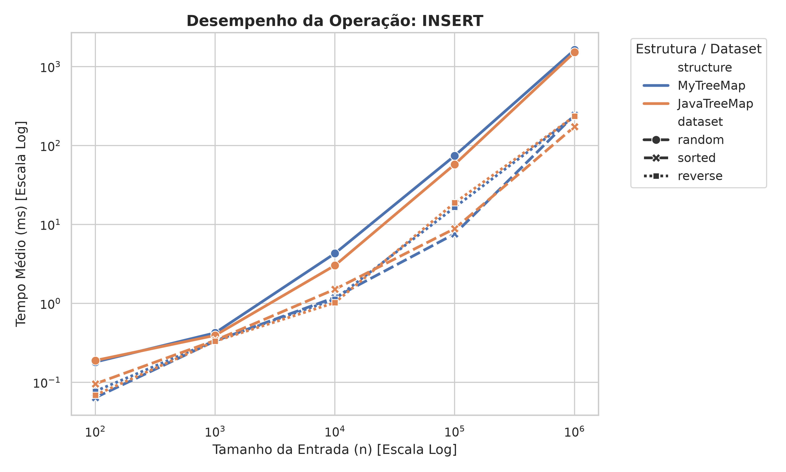
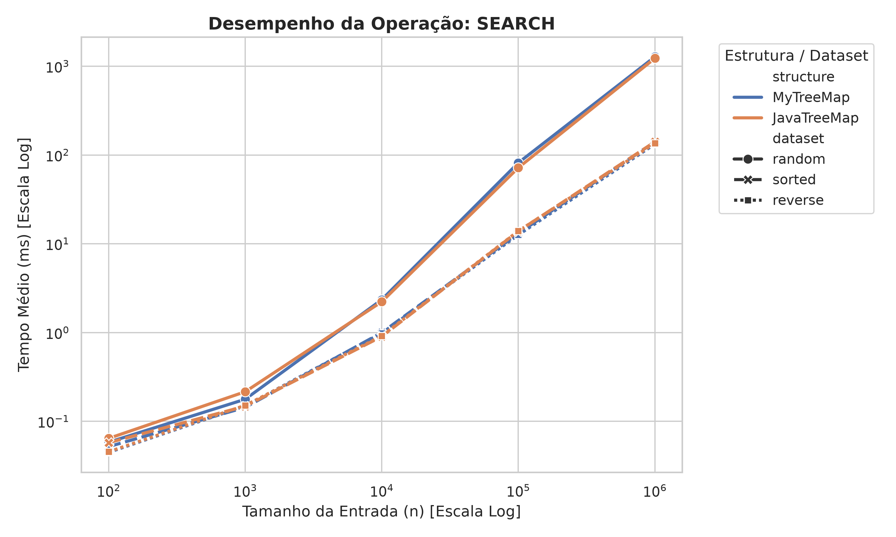
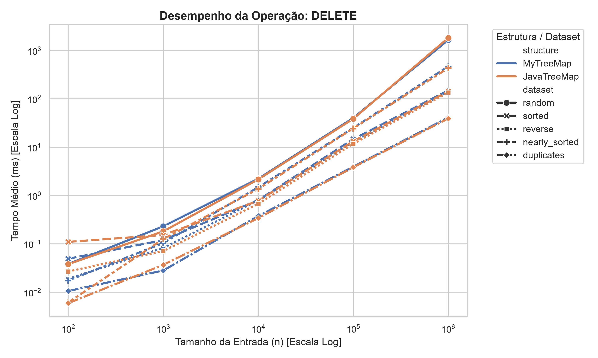
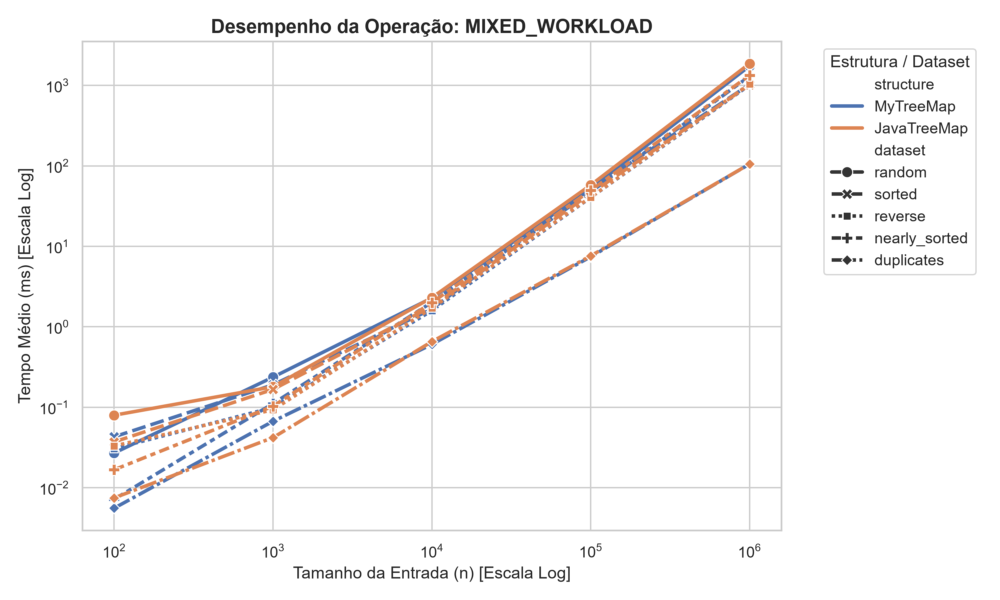

# TreeMap

Este repositório contém a implementação de uma **TreeMap** e um material didático do mesmo com testes de unidade e de eficiência em comparativo com a estrutura de dados já nativa de **Java**.

# Introdução

O TreeMap é uma estrutura de dados que implementa a interface `Map` e usa uma **árvore rubro-negra** como estrutura interna. Diferente de um `HashMap`, o TreeMap mantém todas as chaves armazenadas em ordem crescente. Essa estrutura de dados é comumente usada em situações em que a ordenação dos dados é obrigatória ou são necessárias buscas por intervalos de valores.

# Objetivo

Produzir um material didático e prático completo sobre TreeMap com a implementação da estrutura em conjunto com testes de eficiência nas suas operações em comparação com a já implementada em **Java**(`java.util.TreeMap`).

# [Material Didático](data/text/treemap.md)

Material didático sobre o funcionamento da estrutura de dados TreeMap no padrão da disciplina de Estrutura de Dados e Algoritmos da UFCG (Universidade Federal de Campina Grande). Contendo uma explicação detalhada da estrutura sobre seu funcionamento, implementação e exemplos práticos de sua usabilidade.

# Como rodar os testes
Para que os testes funcionem corretamente é necessário ter `Java 17+` e para gerar os gráficos(opcional) será necessário ter `Python 3` instalado em sua máquina.

Primeiro compile o repositório

**Linux/macOS**
```bash
javac -d out $(find src/main/java -name "*.java")
```

**Windows (PowerShell)**
```powershell
javac -d out (Get-ChildItem -Recurse -Filter *.java src\main\java).FullName
``` 

## Testes

Os testes de unidade contêm asserções para todas as classes utilizadas na TreeMap

**Para executá-los utilize a flag -ea (para habilitar os asserts de Java):**

```bash
java -ea -cp out map.impl.TreeMapAsserts
java -ea -cp out map.interfaces.MapAsserts
java -ea -cp out structures.BinarySearchTreeAsserts
java -ea -cp out structures.RedBlackTreeAsserts
```
## Benchmark

**Para executar o Benchmark utilize o comando:**
```bash 
java -cp out benchmark.BenchmarkRunner
```

## Gráficos

**Os resultados do benchmark ficam amarzenados em [data/text/benchmark_results.csv](data/text/benchmark_results.csv). Para gerar os gráficos basta executar os seguintes comandos:**
```bash
cd scripts
pip install pandas matplotlib seaborn
python plot.py
```

# Metodologia
### Testes de unidade
Os **testes de unidade** são feitos para cada camada da implementação da árvore, demonstrando a hierarquia de dependência da estrutura.

**BinarySearchTreeAsserts** - verifica as operações básicas de uma `árvore binária` como: inserção, remoção, tamanho e limpeza.  
**RedBlackTreeAsserts** - verifica as propriedades de uma `árvore rubro-negra` como: balanceamento, rotações, cor da raiz e a atualização de chaves presentes na árvore.  
**TreeMapAsserts** - verifica as propriedades da `TreeMap` com a implementação da interface `Map`.  
**MapAsserts** - verifica as operações de um `Map` como: inserção, busca, verificação da chave e valor presente no mapa, remoção, limpeza do mapa e as views da coleção.  


Utilizando os asserts de Java para fazer essa verificação em todas as classes de teste.

### Benchmark

O **benchmark** compara a `TreeMap` deste repositório com a de Java (`java.util.TreeMap`), medindo o tempo de execução das seguintes operações:

**INSERT** - inserção dos elementos presentes no dataset.  
**SEARCH** - busca dos elementos de uma estrutura já populada.  
**DELETE** - remoção dos elementos de uma estrutura já populada.  
**MIXED_WOARKLOAD** - uma carga de trabalho mista com 70% de busca, 20% de inserção e 10% de remoção para ter uma visão mais prática do funcionamento das estruturas.

### Datasets

As operações são testadas com datasets gerados por `DataGenerator` (com uma seed fixa para reprodutibilidade dos testes) são eles:

`random` - valores aleatórios sem ordem.  
`sorted` - valores ordenados de forma crescente.  
`reverse` - valores ordenados de forma decrescente.  
`nearly_sorted` - valores quase ordenados de forma crescente com 10% dos valores em posições trocadas.  
`duplicates` - valores gerados em um intervalo pequeno, criando assim uma alta taxa de duplicação.

Cada operação é executada para os tamanhos de entrada: **100, 1000, 10000, 100000, 1000000**.

### Medição

São executadas 5 repetições de aquecimento (*warmup*), excluídas da medição final, para reduzir o efeito de otimização da JVM.  
Após isso, são executadas 30 repetições com seu tempo de execução cronometrado por `System.nanoTime()`. É calculado o tempo médio e o desvio padrão para cada tamanho de entrada.

# Benchmark
Abaixo está a amostra dos nossos experimentos com gráficos e tabelas registrando os dados coletados.

## Inserção:


### Resultados do benchmark
* Dataset: *random*

|Tamanho | MyTreeMap(ms) | JavaTreeMap(ms) |
|---|---|---|
| 100 | 0.034483 | 0.054630 |
| 1000 | 0.101467 | 0.073243 |
| 10000 | 1.031837 | 0.950887 |
| 100000 | 18.358423 | 17.771543 |
| 1000000 | 694.900857 | 719.421973 |

* Dataset: *sorted*

|Tamanho | MyTreeMap(ms) | JavaTreeMap(ms) |
|---|---|---|
| 100 | 0.032423 | 0.019107 | 
| 1000 | 0.087563 | 0.119833 |
| 10000 | 0.552017 | 0.580303 |
| 100000 | 9.482713 | 8.480597 |
| 1000000 | 91.026483 | 95.285190 |

* Dataset: *reverse*

|Tamanho | MyTreeMap(ms) | JavaTreeMap(ms) |
|---|---|---|
| 100 | 0.019927 | 0.023147 |
| 1000 | 0.042057 | 0.040627 |
| 10000 | 0.485470 | 0.519300 |
| 100000 | 8.554627 | 7.670820 |
| 1000000 | 124.017217 | 88.197363 |

* Dataset: *nearly_sorted*

|Tamanho | MyTreeMap(ms) | JavaTreeMap(ms) |
|---|---|---|
| 100 | 0.007220 | 0.007007 |
| 1000 | 0.050267 | 0.058730 |
| 10000 | 0.880417 | 0.831600 |
| 100000 | 12.677910 | 12.949673 |
| 1000000 | 220.449987 | 218.309243 |

* Dataset: *duplicates*

|Tamanho | MyTreeMap(ms) | JavaTreeMap(ms) |
|---|---|---|
| 100 | 0.001943 | 0.003817 |
| 1000 | 0.018737 | 0.018750 |
| 10000 | 0.287697 | 0.293797 |
| 100000 | 3.511287 | 3.726837 |
| 1000000 | 44.081883 | 38.793603 |

## Busca:


### Resultados do benchmark
* Dataset: *random*

|Tamanho | MyTreeMap(ms) | JavaTreeMap(ms) |
|---|---|---|
| 100 | 0.012097 | 0.029120 |
| 1000 | 0.051540 | 0.122547 |
| 10000 | 0.867517 | 0.811160 |
| 100000 | 16.466040 | 16.868800 |
| 1000000 | 518.930530 | 611.292633 |

* Dataset: *sorted*

|Tamanho | MyTreeMap(ms) | JavaTreeMap(ms) |
|---|---|---|
| 100 | 0.018437 | 0.044477 | 
| 1000 | 0.070830 | 0.069610 |
| 10000 | 0.436360 | 0.460647 |
| 100000 | 6.408250 | 6.254787 |
| 1000000 | 69.936893 | 67.338487 |

* Dataset: *reverse*

|Tamanho | MyTreeMap(ms) | JavaTreeMap(ms) |
|---|---|---|
| 100 | 0.013087 | 0.013697 |
| 1000 | 0.032213 | 0.037493 |
| 10000 | 0.484593 | 0.472327 |
| 100000 | 6.920037 | 7.290717 |
| 1000000 | 70.982670 | 68.863863 |

* Dataset: *nearly_sorted*

|Tamanho | MyTreeMap(ms) | JavaTreeMap(ms) |
|---|---|---|
| 100 | 0.034317 | 0.003197 |
| 1000 | 0.029717 | 0.040157 |
| 10000 | 0.549213 | 0.546860 |
| 100000 | 8.720697 | 9.111020 |
| 1000000 | 203.959430 | 198.428943 |

* Dataset: *duplicates*

|Tamanho | MyTreeMap(ms) | JavaTreeMap(ms) |
|---|---|---|
| 100 | 0.001310 | 0.001513 |
| 1000 | 0.011367 | 0.014207 |
| 10000 | 0.308773 | 0.310287 |
| 100000 | 3.783163 | 3.562753 |
| 1000000 | 36.957660 | 35.589790 |

## Remoção:

* Dataset: *random*

|Tamanho | MyTreeMap(ms) | JavaTreeMap(ms) |
|---|---|---|
| 100 | 0.038490 | 0.038060 |
| 1000 | 0.231087 | 0.181873 |
| 10000 | 2.232950 | 2.158990 |
| 100000 | 40.353910 | 38.740230 |
| 1000000 | 1663.655473 | 1829.217693 |

* Dataset: *sorted*

|Tamanho | MyTreeMap(ms) | JavaTreeMap(ms) |
|---|---|---|
| 100 | 0.049343 | 0.110107 | 
| 1000 | 0.119750 | 0.152927 |
| 10000 | 0.808210 | 0.779810 |
| 100000 | 14.734937 | 13.298353 |
| 1000000 | 150.193110 | 143.050723 |

* Dataset: *reverse*

|Tamanho | MyTreeMap(ms) | JavaTreeMap(ms) |
|---|---|---|
| 100 | 0.019060 | 0.026883 |
| 1000 | 0.082590 | 0.071270 |
| 10000 | 0.795943 | 0.675307 |
| 100000 | 13.055067 | 11.810177 |
| 1000000 | 142.661820 | 135.898617 |

* Dataset: *nearly_sorted*

|Tamanho | MyTreeMap(ms) | JavaTreeMap(ms) |
|---|---|---|
| 100 | 0.017483 | 0.006157 |
| 1000 | 0.104243 | 0.126097 |
| 10000 | 1.488433 | 1.370757 |
| 100000 | 25.083693 | 24.530923 |
| 1000000 | 471.246363 | 434.026320 |

* Dataset: *duplicates*

|Tamanho | MyTreeMap(ms) | JavaTreeMap(ms) |
|---|---|---|
| 100 | 0.010597 | 0.005930 |
| 1000 | 0.028193 | 0.036920 |
| 10000 | 0.377490 | 0.341830 |
| 100000 | 3.960160 | 3.842133 |
| 1000000 | 41.250253 | 39.329247 |

## Carga de trabalho mista:

* Dataset: *random*

|Tamanho | MyTreeMap(ms) | JavaTreeMap(ms) |
|---|---|---|
| 100 | 0.026950 | 0.079556 |
| 1000 | 0.236487 | 0.179607 |
| 10000 | 2.279833 | 2.303287 |
| 100000 | 52.197650 | 57.695787 |
| 1000000 | 1744.929953 | 1867.376700 |

* Dataset: *sorted*

|Tamanho | MyTreeMap(ms) | JavaTreeMap(ms) |
|---|---|---|
| 100 | 0.042883 | 0.037047 | 
| 1000 | 0.189990 | 0.166570 |
| 10000 | 1.659787 | 1.788107 |
| 100000 | 51.545837 | 45.384610 |
| 1000000 | 1025.336167 | 1017.061430 |

* Dataset: *reverse*

|Tamanho | MyTreeMap(ms) | JavaTreeMap(ms) |
|---|---|---|
| 100 | 0.030630 | 0.033030 |
| 1000 | 0.099330 | 0.092907 |
| 10000 | 1.589710 | 1.709173 |
| 100000 | 40.477637 | 40.779010 |
| 1000000 | 1011.911620 | 1041.278630 |

* Dataset: *nearly_sorted*

|Tamanho | MyTreeMap(ms) | JavaTreeMap(ms) |
|---|---|---|
| 100 | 0.007170 | 0.016713 |
| 1000 | 0.111030 | 0.102850 |
| 10000 | 2.011827 | 2.000830 |
| 100000 | 47.466727 | 49.508213 |
| 1000000 | 1301.736890 | 1336.462623 |

* Dataset: *duplicates*

|Tamanho | MyTreeMap(ms) | JavaTreeMap(ms) |
|---|---|---|
| 100 | 0.005563 | 0.007467 |
| 1000 | 0.066910 | 0.041913 |
| 10000 | 0.604013 | 0.654113 |
| 100000 | 7.417937 | 7.604673 |
| 1000000 | 105.313793 | 105.468160 |

* **Vale ressaltar que o benchmark foi feito em um ambiente com as seguintes configurações:**

| | | |   
|--- | --- | --- |
| *Processador* | Intel Core I7 150U 1.8GHz |
| *Memória Ram* | 32GB |
| *Sistem Operacional* | Windows 11 |

