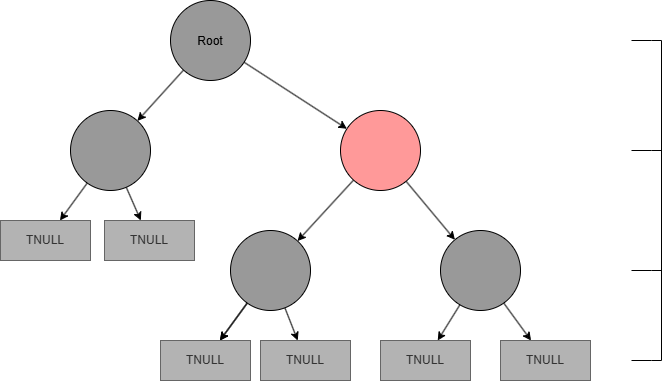
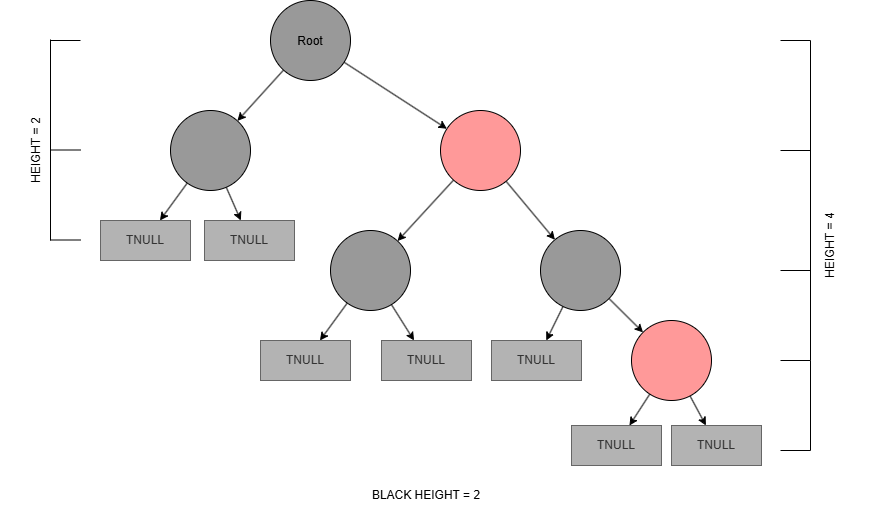

<!--toc:start-->
- [O Que É Uma Árvore Preto-Vermelha?](#o-que-é-uma-árvore-preto-vermelha)
- [O Nó](#o-nó)
  - [Os Nós Nulos de Uma Árvore Preto-Vermelha](#os-nós-nulos-de-uma-árvore-preto-vermelha)
- [Propriedades](#propriedades)
- [Altura](#altura)
<!--toc:end-->
Imagine uma situação em que você precisa fazer múltiplas inserções e remoções na sua estrutura de árvore, ter o menor custo possível e manter o balanceamento para que operações como a busca continuem sendo executadas em complexidade $O(log(n))$. Baseada no conhecimento adquirido até agora na displina, a resposta natural seria o uso de uma árvore AVL, contudo, por possuir uma política de balanceamento muito rígida, a árvore AVL não consegue atender a essas condições.

O balanceamento de uma árvore AVL exige que a diferença entre as subárvores esquerda e direita de qualquer nó não pode ser maior que 1. Consequentemente, as inserções e especialmente as remoções podem demandar muitas rotações para restaurar o equilíbrio e manter a árvore plana. Se uma aplicação faz muitas inserções/remoções, o custo de rebalanceamento pode ser alto. Para ocasiões em que você adiciona e/ou remove muitos dados, a melhor opção é uma Árvore Preto-Vermelha.

# O Que É Uma Árvore Preto-Vermelha?

Uma Árvore Preto-Vermelha é uma árvore binária de busca auto-balanceada que possui um sitema de coloração para os nós e impõe regras para que seja obtido um balanceamento aproximado.

# O Nó

O nó guarda uma informação extra: **cor**, que pode ser vermelha ou preta. A cor é um tipo de classe que representa constantes pré-definidas e únicas, um enum.

```java
public class Node{
    int value;
    Color color;

    Node parent;
    Node left;
    Node right;

    public Node(K key, V value) {
        this.key = key;
        this.value = value;
        this.color = Color.RED;
    }

    public void setColor(Color color){
        this.color = color;
    }
}

enum Color {
    RED,
    BLACK
}
}
```

Iniciamos o nó com a cor vermelha devido à uma propriedade, mais abaixo falaremos sobre.

## Os Nós Nulos de Uma Árvore Preto-Vermelha

Um nó NIL é um nó folha que não possui valor. Esse nó sentinela nos ajuda a determinar a cor dos tios ou irmãos, sendo essencial nas propriedades de coloração.

- Um nó NIL é sempre uma folha e não pode ter filhos;
- O nó sentinela é sempre **preto**;

# Propriedades

1. Cada nó é vermelho ou preto;

2. A raiz da árvore é sempre preta;

3. Toda folha NIL é preta;

4. Um nó vermelho não pode ter filhos vermelhos, ou seja, não podem ter nós vermelhos seguidos;

5. O "Black Height" é o número de nós pretos de um nó até suas folhas nulas(NIL). Todo caminho de um nó até suas folhas descendentes possui o mesmo Black Height;

# Altura

A altura de uma árvore preto-vermelho é definida pelo maior caminho da raiz a uma folha NIL, ou seja, o número de arestas no maior caminho da raiz até qualquer folha nula.

<figure style="text-align: center; margin: 30px auto;">
    
    <figcaption style="text-align: center; margin-top: 15px; max-width: 70%; margin-left: auto; margin-right: auto;">
        Altura de uma Árvore PV.
    </figcaption>
</figure>

A altura dessa árvore é 3, visto que o maior caminho da raiz até uma folha NIL possui 3 arestas.

O caminho mais longo da raiz até uma folha nula não pode ser duas vezes maior que o menor caminho. Isso pode ser explicado da seguinte maneira: se uma árvore rubro-negra tem um black height constante, o menor caminho possível possui n nós pretos tal que n = black height. Já o maior caminho, deve possuir o maior número de nós vermelhos possível, e, seguindo a propriedade 4, a estrutura ótima é alternar as cores em "preto-vermelho-preto-vermelho".

<figure style="text-align: center; margin: 20px auto;">
    
    <figcaption style="text-align: center; margin-top: 8px;">
        Maior e menor caminho em uma Árvore PV.
    </figcaption>
</figure>

No exemplo acima, o menor caminho tem comprimento 2 e possui obrigatoriamente apenas nós pretos. Logo, o maior caminho possui comprimento 4 intercalando as cores dos nós.

Podemos concluir que se o menor caminho possui **n** nós pretos, o maior caminho terá no máximo **2n** nós, sendo **n** nós pretos e **n** nós vermelhos. Ou seja, o maior caminho é no máximo o dobro do menor. Do ponto de vista computacional, essa característica é impressionante: se o caminho mais longo não pode ser muito maior que o mais curto, a operação de busca nunca será realizada em $O(n)$ e é garantido que sempre suficiente para que seja realizada em $O(log(n))$. Vale destacar que a operação de busca vai ser rápida, porém, um pouco mais lenta que a de uma árvore AVL.
